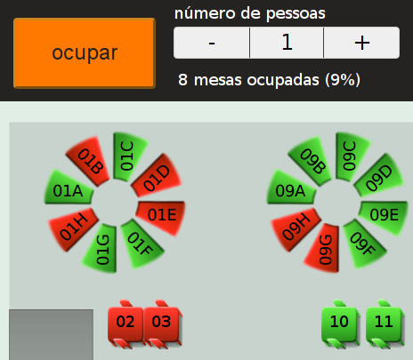
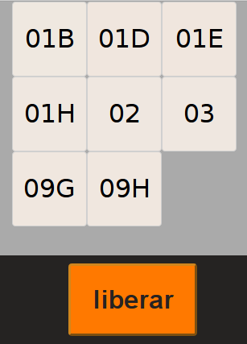
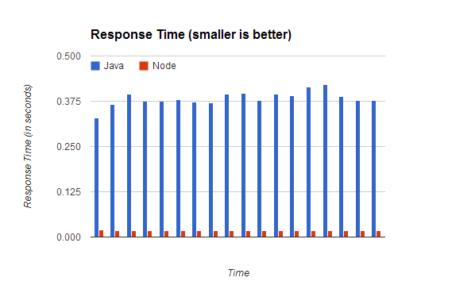
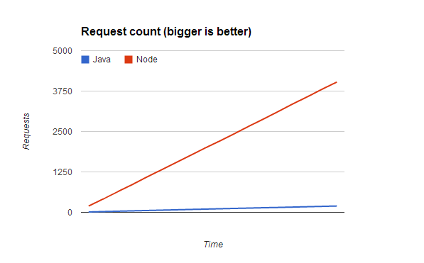

title: Benvenuto Node.js
date: 10-21-2012
template: article.jade
author: gadr90

**Benvenuto** é um webapp para auxiliar a distribuição de mesas em restaurantes. Este artigo detalha o processo de reescrever um aplicativo do stack Java no stack Node.js.

Pontifícia Universidade do Rio de Janeiro

 

Departamento de Informática

 

<h2 style="text-align:center">Benvenuto Node</h2>

<h4 style="text-align:center">Estudo de caso: Migração de um Web-App Java para Node.js</h3>

 

Orientador:

<strong>Edmundo Torreão</strong>

Aluno:

<strong>Guilherme Rodrigues</strong>

6 de Dezembro de 2012

 

**Benvenuto** é um webapp para auxiliar a distribuição de mesas em restaurantes. Este artigo detalha o processo de reescrever um aplicativo do stack Java no stack Node.js.

O sistema tem duas telas principais:

- Um mapa de mesas, no qual todas as mesas são desenhadas na tela na cor verde ou vermelha, dependendo se a mesa está atualmente livre ou ocupada. Aqui, pode-se selecionar mesas e ocupá-las.
- Uma lista de mesas atualmente ocupadas, onde as mesas têm uma indicação de cor dependendo de há quanto tempo estão ocupadas. Aqui, pode-se selecionar mesas e liberá-las.

 

Interface da Recepção

 

Interface do Salão

 

Um requisito fundamental do sistema é que as atualizações sobre o mapa de mesas devem ser percebidas em *realtime* por todos os clients.
A primeira versão do sistema foi construída usando um stack *semi-tradicional* de desenvolvimento web:

- Play Framework 1.2 (2011) - um framework web *full-stack* Java, que utiliza o servidor JBoss Netty. Tem como principais objetivos a escalabilidade e simplicidade de desenvolvimento. Favorece aplicações "stateless" - não dá suporte a sessões.
- PostgreSQL 9.0 (2010) - um banco de dados relacional SQL open-source.
- KnockoutJS 2.0 (2011) - uma biblioteca Javascript que implementa o padrão MVVM, permitindo *data-bind* entre objetos Javascript e o DOM, eliminando a necessidade de grandes quantidades de código JQuery para dinamizar a interface.

Esse artigo irá discutir as vantagens e dificuldades encontradas ao realizar o port deste aplicativo para um stack de tecnologias mais recentes e mais orientadas a *single-page applications*. O stack escolhido foi:

- Node.js (2011) - um *runtime* de Javascript no server-side. É *event-driven* e utiliza I/O assíncrono, com objetivo de maximizar a escalabilidade. Sua principal vantagem é permitir a utilização da mesma linguagem tanto no browser quanto no servidor. Isso implica em grandes facilidades para o desenvolvimento.
- Express 3.0 (2012) - um framework web para Node.js.
- Socket.IO - uma biblioteca para comunicação assíncrona no ambiente Node.js que expõe uma API de publish/subscribe transparente entre clientes e servidor.
- CoffeeScript - uma pequena linguagem que *compila para* Javascript. Copia algumas linguagens mais recentes como Ruby e Python nos seus melhores pontos e esconde as piores partes do Javascript.
- Redis - Um banco de dados chave/valor extremamente rápido, em memória, voltado para datasets pequenos.

### Introdução

### Parte 1 - Motivação e Principais Dificuldades

#### ORM e a dança de formatos

Ao desenvolver um aplicativo "desktop", o arquiteto de software tem total controle sobre todas as partes do sistema: a persistência, a lógica de negócio e a visualização e interação.

Naturalmente, é comum utilizar-se de apenas uma linguagem de programação para escrever todas as partes de um aplicativo, a fim de minizar a complexidade de comunicação entre os módulos ou partes do sistema. Entretanto, ao escrever aplicativos web, tipicamente encontram-se algumas severas restrições.

Uma das maiores restrições é aquela inerente da *visualização* e *interação com o usuário*, que serão necessariamente expressas através de um documento HTML e um *web browser*. Dessa forma, introduz-se, no mínimo, um nível de tradução entre a lógica de negócio, escrito em alguma linguagem, e a apresentação.

Tipicamente, os aplicativos web modernos se utilizam ainda de Javascript para dinamizar o conteúdo do documento HTML e permitir interações mais naturais, independentes do ciclo de request e response.

Uma outra restrição é a comum necessidade de escalabilidade e utilização multi-usuário do sistema. Isso prejudica a escolha de ferramentas de persistência mais simples e diretamente disponíveis nas linguagens (como, em Java, a serialização de objetos). A escolha mais comum para persistência é um banco de dados relacional, como MySQL, PostgreSQL e outros.

Assim, introduz-se mais um nível de tradução no aplicativo: a camada de persistência representa os objetos de negócio de uma forma diferente da camada de lógica de negócio, e um componente de *ORM* (Object Relational Mapping) é utilizado para facilitar essa conversão.

Configura-se, então, a *dança dos formatos*: no ciclo de vida típico de um objeto, ele vai ser:

- Recuperado de uma tabela de banco de dados relacional
- Transformado em um objeto na linguagem de programação utilizada, o qual também apresenta comportamentos e possivelmente manipulará os seus dados ou de outros objetos
- Transformado em uma representação textual HTML para visualização por um browser
- Transformado em um objeto Javascript para permitir uma interação dinâmica.
- Finalmente, fará todo o caminho de volta até sua tabela relacional.

Todas essas transformações implicam em grande quantidade de código que não se presta diretamente a solucionar os problemas de negócio os quais se propõe resolver o aplicativo.

#### Comunicação Realtime - Long polling

Muitos aplicativos têm por requisito a comunicação em tempo real entre múltiplos clientes. Até pouco tempo atrás, isso não era possível no ambiente web devido à precariedade dos browsers, e aplicativos tempo real eram tipicamente *desktop*.

Recentemente, a tecnologia AJAX (Asynchronous JavaScript and XML) permitiu a comunicação com o servidor sem necessitar de uma atualização completa da página. Com isso, foram desenvolvidas algumas técnicas para estabelecer a comunicação em tempo real com o servidor.

Uma das técnicas mais famosas é o *long-polling*. Ela consiste basicamente de três passos:

- O browser faz um request AJAX para um endpoint no servidor.
- O servidor *segura* esse request aberto enquanto nenhum evento significativo é gerado pela lógica de negócio
- Quando um evento é gerado, o servidor responde para o browser, que reinicia o ciclo emitindo um novo request.

Essa técnica é utilizada com sucesso pelo Benvenuto, mas ela é sujeita a alguns problemas:

- Se um request AJAX é interrompido, não existe nenhum outro jeito do servidor notificar o cliente de novos eventos. Assim, a implementação deve ser resistente a quedas de conexão e saber reestabelecer o pedido sempre que ocorrerem problemas.
- Browsers mobile estão sujeitos a muitas interrupções que podem parar requests AJAX, como entrar em modo *sleep*, recebimento de chamadas, etc.
- O servidor deve saber lidar com as chamadas de forma eficiente para não trancar threads enquanto segura um request aberto.

Assim, é necessário grande cuidado ao implementar uma solução de long-polling.

### Parte 2 - Escolha das Tecnologias e Benefícios Esperados

#### Node.js e Express 3.0

Node.js é uma plataforma para execução de Javascript. Assim como Ruby e Python, Javascript é uma linguagem dinâmica e interpretada: ela necessita de um programa que interprete seus comandos para um nível mais baixo. No browser Google Chrome, a *engine* responsável por interpretar Javascript se chama **V8**. O Node.js utiliza a engine V8 e disponibiliza bibliotecas para transformar o Javascript numa linguagem viável para o server-side.

As vantagens de utilizar o Node.js são muitas, especialmente ao considerar o quesito performance:

- A engine V8 é [muito performática][1], o que por sua vez garante boa performance do ambiente Node.js
- Node.js utiliza um loop de eventos que visa otimizar a performance de operações intensiva em I/O. Alguns benchmarks demonstram que ele é capaz de [mais de 4000 requests por segundo][2], ou 5x mais do que um stack Apache/PHP.
- Menor utilização de memória, comparado com Java e outros frameworks mais "robustos".
- Lida muito bem com múltiplos clientes concorrentes. Alguns benchmarks já conseguiram lidar com mais de [250 mil conexões concorrentes][3]

Mas performance não é o único motivo para utilizar o Node.js. Ao utilizar a mesma linguagem no client e no servidor, é possível reutilizar código entre esses dois ambientes e diminuir a impedância entre eles. Menos conversões significa um código menor e mais focado em resolver os problemas de negócio.

Uma outra notável qualidade do Node.js é sua comunidade e a organização de pacotes em torno do **npm** (node package manager). Inspirado nas *gems* do Ruby, o node já nasceu com o conceito de pacotes e a quantidade de bibliotecas open-source cresce em uma taxa frenética.

Um desses pacotes é o excelente **Express**. Se trata de um framework para desenvolvimento de aplicativos web. Ele oferece um modelo simples para a criação rápida de aplicativos, solucionando muitos problemas comuns como autenticação, manipulação de cookies, etc. Atualmente é o framework web mais utilizado para Node.js.

#### Socket.IO

Socket.IO é uma biblioteca que oferece comunicação realtime entre um servidor Node.js e seus clientes. Para tanto, ela disponibiliza uma API de publish/subscribe muito simples, acessível de ambos os lados do aplicativo.

Uma vez conectado no servidor Node.js, um cliente pode se inscrever nos tópicos que lhe interessam e enviar mensagens em tópicos, assim como o servidor. Dessa forma, existe uma comunicação transparente entre as partes, independente de qualquer ciclo de request e response.

Como canal de comunicação, o Socket.IO irá preferir utilizar [*WebSockets*][4] se possível, utilizando *fall-backs* como Flash ou long-polling se necessário. Todos os cuidados são tomados, entretanto, para garantir o recebimento das mensagens pelos clientes e pelo servidor, sem que o usuário da biblioteca tenha que se preocupar com problemas como interrupção de conexão.

A utilização do Socket.IO, portanto, traz benefícios óbvios para o Benvenuto pois descarta a necessidade de uma implementação própria de long-polling, disponibilizando uma forma eficiente e segura de trocar mensagens entre o servidor e os clientes.

#### Redis

Redis é um banco de dados chave-valor em memória. Ele foca em atender os problemas com *datasets* pequenos, que caibam completamente na memória principal. Em um banco de dados chave-valor, não existe a noção de uma tabela com campos pré-definidos. Em geral, armazena-se uma string (um valor) com um nome (uma chave). Para acessar esse valor, é preciso ter em mãos a chave.

Dado que a serialização JSON é uma forma muito comum e conveniente de transmitir objetos Javascript, bancos de dado chave-valor vêm sendo utilizados com grande sucesso pelos desenvolvedores do stack Node.js. Basta serializar um objeto e guardar o JSON com uma chave identificadora. Normalmente, utiliza-se o conceito de "namespace" para artificialmente agrupar chaves que se relacionam. Por exemplo, poderíamos guardar um usuario com a chave "app:user:3" onde 3 é o id do usuário.

O banco Redis beneficia o Benvenuto principalmente por simplificar a forma de armazenamento dos objetos, sem necessitar da criação de um "esquema" de banco de dados, e por apresentar um significativo ganho de performance em relação a bancos relacionais, que utilizam pesadamente o acesso à disco.

### Parte 3 - Estratégia de migração do server-side
#### Mimicando a API JSON no Node.js

Escolhidas as tecnologias que desejamos utilizar para escrever a nova versão do Benvenuto, resta a pergunta: Por onde começar?

Ao tomar essa decisão, um ponto foi decisivo: a camada de apresentação deveria ser mantida basicamente imodificada - continuando a consumir JSON de uma API e apresentar a interface com a biblioteca KnockoutJS.

Assim, o primeiro protótipo do aplicativo Benvenuto em Node.js consistiu de uma API *mock* que retornava apenas JSON estático. Para fazer isso, todas as chamadas que retornavam JSON no serviço antigo tiveram um *exemplar* de JSON recortado e guardado em um arquivo, que era lido e entregue pelo novo servidor.

Feito isso, passava a ser necessário mimicar de fato o comportamento da API - permitindo, por exemplo, ocupação e liberação de lugares. Para tanto, uma variável em memória passou a guardar todo o JSON estático do mapa de mesas e a ser modificada pelas chamadas à API. O programa passou a apresentar o mesmo comportamento que o serviço antigo, em menos de 200 linhas de código.

Claro, nesse momento ainda não existe a persistência de objetos. A cada "reset" do aplicativo, o estado era perdido. Ainda assim, já é possível perceber que existe uma clara queda de complexidade no código do servidor.

### Parte 4 - Estratégia de migração da persistência
#### Estruturando os dados para um banco chave/valor

Resolvida a camada da API JSON, é preciso estabelecer uma forma conveniente de modelar nossos objetos para uma persistência simples e eficiente utilizando o banco REDIS.

A estrutura original de objetos utilizava-se pesadamente de *foreign keys* - típico de um banco de dados relacional. Entretanto, *foreign keys* não são fáceis de utilizar em um banco chave-valor pois não existe suporte nenhum à essa lógica na camada do banco.

Por exemplo, a classe GenericTable, que representa uma mesa, era definida como:

	@Entity
	@Inheritance(strategy = InheritanceType.SINGLE_TABLE)
	@DiscriminatorColumn(name="table_type",discriminatorType=DiscriminatorType.CHAR)
	@DiscriminatorValue("N")
	public class GenericTable extends Model {
	    public int maxNumberOfPlaces = 1;
	        public String label = "";
	        @OneToMany(cascade = CascadeType.ALL, mappedBy = "table")
	        public List<Place> places = new ArrayList<Place>();
	    @Embedded
	    public Point position;
	    @ManyToOne
	    public Layout layout;
	(...)
	}

 
E a classe Place, que representa um "lugar" à mesa:

	@Entity
	@Inheritance(strategy = InheritanceType.SINGLE_TABLE)
	@DiscriminatorColumn(name="place_type",discriminatorType=DiscriminatorType.CHAR)
	@DiscriminatorValue("N")
	public class Place extends Model {
	    public String label = "";
	    @Embedded
	    public Point position;
	    public int numberOfOccupants;
	    public Double rotation = 0D;
	    @ManyToOne
	    public GenericTable table;
	(...)
	}

 
O JSON produzido pela API ao pedir todas as mesas livres resultante:

	{
		gridSizePixels : 10,
		name : "Couveflor-PUC-1",
		tables : [ {
			class : "models.RoundTable",
			id : 2,
			label : "01",
			places : [ {
				id : 3,
				label : "01A",
				numberOfOccupants : 1,
				occupied : false,
				rotation : 0.071525864538728,
				x : -52,
				y : -19
			}, {
				id : 4,
				label : "01B",
				numberOfOccupants : 1,
				occupied : false,
				rotation : 45.2975697722287,
				x : -23,
				y : -50
			}, (...) ],
			x : 9,
			y : 7
		}, {
			class : "models.RoundTable",
			id : 11,
			label : "09",
			places : [ {
				id : 12,
				label : "09A",
				numberOfOccupants : 1,
				occupied : false,
				rotation : 0.071525864538728,
				x : -52,
				y : -19
			}, {
				id : 13,
				label : "09B",
				numberOfOccupants : 1,
				occupied : false,
				rotation : 45.2975697722287,
				x : -23,
				y : -50
			}, (...) ],
			x : 34,
			y : 7
		} ]
	}

 
Como se pode ver, a estrutura principal consiste em um array de *tables*, cada uma com seu conjunto de *places*. Isso representa um grande inconveniente para persistir esses objetos no REDIS, onde não há como facilmente como fazer referência a "objetos filhos".

A solução proposta foi inverter a estrutura - tornando *Place* o modelo principal. Ele é, afinal, o modelo que serve como referência para as ações de *ocupar* e *liberar*, por exemplo.

Finalmente, foi necessário *desnormalizar* os atributos de *Table* dentro de cada *Place*. Isso incorre em um pequeno aumento do tamanho total necessário para representar o mapa de mesas, mas resolve o problema de múltiplas entidades. Um pequeno utilitário foi escrito transformar o formato antigo para o formato novo:

	(function() {
	  var flatPlaces, places, placesC, _u;

	  placesC = require('./places.js');

	  _u = require('underscore');

	  places = placesC.collection;

	  flatPlaces = function() {
		return _u.chain(places.tables).map(function(table) {
		  var place, _i, _len, _ref;
		  _ref = table.places;
		  for (_i = 0, _len = _ref.length; _i < _len; _i++) {
			place = _ref[_i];
			place.tableId = table.id;
			place.tableX = table.x;
			place.tableY = table.y;
			place.tableClass = table._class;
		  }
		  return table.places;
		}).flatten().value();
	  };

	  places.places = flatPlaces();

	  places.tables = void 0;

	  console.log(places);

	}).call(this);

 
Agora, o resultado para a chamada do mapa de mesas produz um resultado muito mais simples:

	[
	  {
		"id": 109,
		"label": "37",
		"numberOfOccupants": 2,
		"occupied": false,
		"rotation": 0,
		"x": 0,
		"y": 0,
		"tableId": 108,
		"tableX": 33,
		"tableY": 91,
		"tableClass": "models.GenericTable"
	  },
	  {
		"id": 145,
		"label": "53",
		"numberOfOccupants": 2,
		"occupied": false,
		"rotation": 0,
		"x": 0,
		"y": 0,
		"tableId": 144,
		"tableX": 49,
		"tableY": 130,
		"tableClass": "models.GenericTable"
	  },
	  {
		"id": 147,
		"label": "55",
		"numberOfOccupants": 2,
		"occupied": false,
		"rotation": 90,
		"x": 0,
		"y": 0,
		"tableId": 146,
		"tableX": 56,
		"tableY": 126,
		"tableClass": "models.GenericTable"
	  }, (...)
	]

 
Então, com uma estrutura "planificada", persistir os objetos é simples. O esquema de persistência é o seguinte:

- Uma *key* de place é formada por "layout", seguido do id do layout, seguido de "place", seguido do id do place. Por exemplo: "layout:1:place:109".
- Um **set** é utilizado para guardar todas as *keys* de *Places*. Ou seja, esse set contém, por exemplo:
	[layout:1:place:109, layout:1:place:110, layout:1:place:111, (...)]
- Existe um método genérico, `getMultiplePlaces( idsArray )` para recuperar **n** lugares do banco, dado seus *id's*.
- Existe um método que recupera **todos** os lugares do banco, utilizando o método `getMultiplePlaces` e o **set** que contém todos os *id's*.

Agora, recuperar e persistir um ou múltiplos *Places* passa a ser trivial, graças a adequação do modelo de dados, e a persistência está implementada.

### Parte 5 - Medição de resultados
#### LOC - Número de linhas de código

Um dos grandes benefícios de se utilizar linguagens dinâmicas é a grande redução do número de linhas de código em relação a linguagens mais verborrágicas como Java.

Utilizando o programa [cloc][5], podemos observar alguns números interessantes.

Language	files	blank	comment	code

Java		24	237	32		**1200**

Com as novas linguagens e as refatorações feitas, chegamos a um resultado incrível em nosso arquivo principal, `app.coffee`, que contém toda a lógica de API e Persistência:

Language	files	blank	comment	code

CoffeeScript	1	30	50		**217**

Ou seja, uma redução de 5 vezes. Se, como diz Jeff Atwood, [tamanho é o inimigo][6], certamente houve progresso.

Mas e quanto à performance? É possível detectar algum ganho ao utilizar o Node.js e REDIS versus Java e PostgreSQL?

#### Performance - stress test requests/segundo

Utilizando o utilitário [openload][7], foram realizados testes de performance sobre as duas versões do aplicativo.
Para o teste, realizamos chamadas concorrentes a uma URL que devolve todas as mesas do banco de dados, serializadas em JSON.
Conforme esperado, a combinação de Node.js com Redis apresentou uma performance esmagadoramente maior que Java e PostgreSQL.
No geral, foi observado uma diminuição de 20 vezes no tempo de resposta, e consequentemente, um aumento de 20 vezes no número de requests servidos.

 

Tempo de Resposta

 

Número de Requests Servidos

 

### Parte 6 - Conclusão
#### Principais benefícios da migração

A migração do Benvenuto culminou em muitas lições que, em última análise, podem ser traduzidas em uma noção simples: utilize a ferramenta certa para cada problema.

Claramente, Node.js e suas bibliotecas nasceram para solucionar os problemas de desenvolvimento web, e, por isso, oferecem soluções muito mais naturais.
Na persistência, é evidente que, dada a possibilidade, bancos chave-valor em memória são escolhas muito mais sensíveis para uma melhor performance do aplicativo.

Acredito que o stack Java ainda vá sobreviver um longo tempo pois ele tem, de fato, muitos méritos.
Entretanto, empresas novas e pequenas devem focar seus esforços nas novas tecnologias, que oferecem soluções muito mais efetivas para os problemas reais da web hoje.
A escolha entre novas e velhas tecnologias não é uma opção. Utilizar a linguagem e o ambiente que vai solucionar seu problema de forma mais simples é imperativo.

[1]: http://shootout.alioth.debian.org/u32/which-programs-are-fastest.php
[2]: http://zgadzaj.com/benchmarking-nodejs-basic-performance-tests-against-apache-php
[3]: http://blog.caustik.com/2012/04/10/node-js-w250k-concurrent-connections/
[4]: http://en.wikipedia.org/wiki/WebSocket
[5]: http://cloc.sourceforge.net/
[6]: http://www.codinghorror.com/blog/2007/12/size-is-the-enemy.html
[7]: http://openwebload.sourceforge.net/